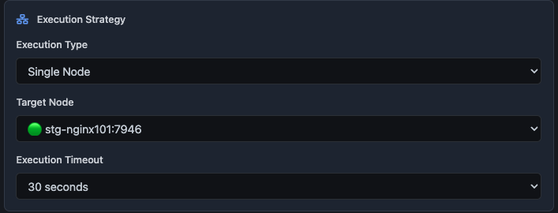

# GoCluster

A Lightweight Distributed Cluster Manager in Go

[](https://opensource.org/licenses/MIT)

## Overview

GoCluster is a lightweight distributed cluster manager written in Go that simplifies cluster management through automatic node discovery, leader election, and state management. It's designed for small to medium-sized distributed systems, featuring an extensible operator plugin system for custom cluster operations.

Designed for SREs in mind, GoCluster automates repetitive cluster operations that would otherwise require manual intervention across multiple nodes. Instead of logging into each node to perform operations like creating namespaces or running backups, GoCluster provides a centralized way to manage these tasks across hundreds of clusters through simple operator definitions.

## Key Features

- **Node Management**
  - Automatic node discovery via UDP
  - Leader election based on node ID
  - Health monitoring and failover handling

- **Operator System**
  - Plugin-based architecture
  - Extensible framework for cluster tasks
  - Web interface integration

## Getting Started

### Prerequisites

- Go 1.21+
- Linux/Unix environment, if you have windows, please do a favor to yourself and throw it away:)

### Installation

```bash
git clone https://github.com/Prajwalprakash3722/gocluster
cd gocluster
make linux
```

### Configuration

Now you have 3 state store options, 

- In-Memory
```yaml
cluster:
  name: docker-cluster
  discovery_port: 7946
  bind_address: 0.0.0.0
  web_address: 0.0.0.0:8080
  enable_operator: true

backend:
  type: memory
nodes:
  node001: localhost:7946

plugins:
  - hello
  - jobs
```

- EtcD
```yaml
cluster:
  name: mycluster-etcd
  discovery_port: 7946
  bind_address: 0.0.0.0
  web_address: 0.0.0.0:8080
  enable_operators: true

backend:
  type: etcd
  namespace: gocluster-test
  
  etcd_endpoints:
    - localhost:2379
  
  etcd_username: ""
  etcd_password: ""
  etcd_cert_file: ""
  etcd_key_file: ""
  etcd_ca_file: ""
  
  leader_ttl: 30s
  renew_interval: 10s

nodes:
  node001: 127.0.0.1:7946

plugins:
  - jobs
  - hello
```

- Zookeeper
```yaml
cluster:
  name: docker-cluster
  discovery_port: 7946
  bind_address: 0.0.0.0
  web_address: 0.0.0.0:8080
  enable_operator: true

backend:
  type: zookeeper
  namespace: "gocluster"
  
  zk_hosts:
    - "localhost:2181"
  zk_timeout: "30s"
  zk_session_path: "/gocluster/sessions"

nodes:
  node001: localhost:7946

plugins:
  - hello
  - jobs

```

### Usage

1. Start the agent:
```bash
./gocluster-manager -c cluster.yaml
```

2. Access the web interface at `http://localhost:8080`, or use the CLI tool to manage the cluster.
3. 


### View Operators from web UI


### Trigger Operations from web UI
 

### Execution Strategy



### CLI Tool

The cluster can be managed using our [CLI tool](https://github.com/Prajwalprakash3722/gocluster-cli). Example commands:

```bash
# List available clusters
gocluster clusters

# Select a cluster
gocluster use stg-nodes

# List operators
gocluster operator list
```

## Operator System

GoCluster uses a plugin system for extending cluster functionality. Custom operators must implement:

```go
type Operator interface {
    Info() OperatorInfo
    Init(config map[string]interface{}) error
    Execute(ctx context.Context, params map[string]interface{}) error
    Rollback(ctx context.Context) error
    Cleanup() error
}
```

### Best Practices

- Implement proper error handling
- Use context for cancellation
- Provide rollback capabilities
- Include validation checks
- Maintain idempotency

## Project Structure

```
.
├── cmd
│   └── gocluster-manager
│       └── main.go
├── configs
│   ├── docker-cluster.yaml
│   └── test-config-etcd.yaml
├── docker
│   ├── cluster.yaml
│   ├── cluster2.yaml
│   └── cluster3.yaml
├── docker-compose.yml
├── Dockerfile
├── go.mod
├── go.sum
├── gocluster-manager
├── gocluster-manager-macos
├── image-1.png
├── image-2.png
├── image-3.png
├── image-4.png
├── image.png
├── internal
│   ├── cluster
│   │   └── manager.go
│   ├── config
│   │   └── config.go
│   ├── operator
│   │   ├── manager.go
│   │   ├── plugins
│   │   │   ├── aerospike
│   │   │   │   ├── aerospike_operator.go
│   │   │   │   └── config.go
│   │   │   ├── hello
│   │   │   │   └── operator.go
│   │   │   ├── jobs
│   │   │   │   └── jobs_operator.go
│   │   │   └── mysql
│   │   │       └── mysql_operator.go
│   │   ├── plugins.go
│   │   └── registry.go
│   ├── types
│   │   └── types.go
│   └── web
│       ├── handler.go
│       ├── static
│       │   ├── css
│       │   │   └── github-style.css
│       │   ├── icons
│       │   └── js
│       │       ├── gocluster-ui.js
│       │       └── operator-forms.js
│       └── templates
│           ├── index.html
│           └── operator-forms.html
├── LICENSE
├── Makefile
├── README.md
├── scripts
│   ├── run-etcd.sh
│   ├── run-zookeeper.sh
│   ├── start-cluster-zk.sh
│   ├── stop-cluster.sh
│   └── test-operations.sh
└── test-config.yaml

22 directories, 43 files
```

## Roadmap
_(Highly dependent on my mood and time availability)_ :smile:
- [ ] Add Debug/Info/Error Logs (priority)
- [ ] Add Tests
- [x] Custom operation framework
- [x] Distributed task execution system
- [ ] Secure communication (TLS/mTLS)
- [x] Web-based cluster management UI
- [x] Metrics and monitoring
- [ ] Multi-region support

## Contributing

Contributions are welcome. Please submit a pull request for review.

## License

[MIT License](LICENSE)

---
Created by [@prajwal.p](https://github.com/Prajwalprakash3722)
